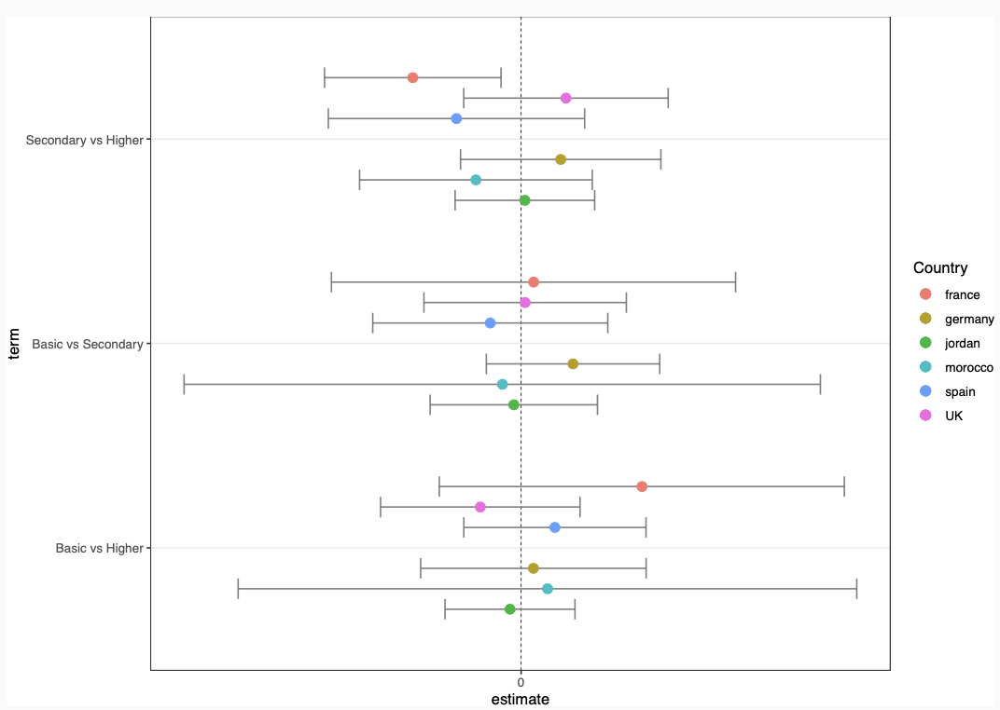

```{r, include=FALSE}
knitr::opts_chunk$set(
  results='asis', 
  echo = FALSE
)

library(glue)
library(tidyverse)

# ======================================================================
# These variables determine how the the data is loaded and how the exports are
# done.

# Is data stored in google sheets? If no data will be gather from the csvs/
# folder in project
using_googlesheets <- TRUE

# Just the copied URL from the sheet
positions_sheet_loc <- "https://docs.google.com/spreadsheets/d/1tiYpocD-0UMrJuUUeKj0y9oUW4QAaGoTm4bv3h--asU/edit?usp=sharing"

# Is this sheet available for anyone to read? If you're using a private sheet
# set this to false and go to gather_data.R and run the data loading manually
# once to cache authentication
sheet_is_publicly_readable <- TRUE

# Is the goal of this knit to build a document that is exported to PDF? If so
# set this to true to have links turned into footnotes at the end of the
# document
PDF_EXPORT <- FALSE


CV_PDF_LOC <- "<https://github.com/andpir55/CV/blob/master/AndrePirralhaCV.pdf>"
CV_HTML_LOC <- "<https://andrepirralha.com/>"


# A global (gasp) variable that holds all the links that were inserted for
# placement at the end
links <- c()

# ======================================================================
# Now we source two external scripts. One contains functions for building the
# text output and the other loads up our data from either googlesheets or csvs

# Functions for building sections from CSV data
source('parsing_functions.R') 

# Load data for CV/Resume
source('gather_data.R')
```


```{r}
# When in export mode the little dots are unaligned, so fix that. 
if(PDF_EXPORT){
  cat("
  <style>
  :root{
    --decorator-outer-offset-left: -6.5px;
  }
  </style>")
}
```


Aside
================================================================================


{width=100%}

```{r}
# When in export mode the little dots are unaligned, so fix that. 
if(PDF_EXPORT){
  glue("View this CV online with links at _{CV_HTML_LOC}_")
} else {
  glue("[<i class='fas fa-download'></i> Download a PDF of this CV]({CV_PDF_LOC})")
}
```

Contact {#contact}
--------------------------------------------------------------------------------

```{r}
contact_info %>% 
  glue_data("- <i class='fa fa-{icon}'></i> {contact}")
```


Skills {#skills}
--------------------------------------------------------------------------------

```{r}
build_skill_bars(skills)
```

  
  
Languages {#languages}
--------------------------------------------------------------------------------

```{r}
languages <- tribble(
  ~skill,               ~level,
  "Portuguese",           5,
  "English",              5,
  "Spanish",              5,
  "Italian",              4,
  "German",               2,
  "French",               2
)

build_skill_bars(languages)
```

Main
================================================================================

André Pirralha {#title}
--------------------------------------------------------------------------------

```{r}
print_text_block(text_blocks, 'intro')
```


Work Experience {data-icon=laptop}
--------------------------------------------------------------------------------

```{r}
print_section(position_data, 'research_positions')
```


Education {data-icon=graduation-cap data-concise=true}
--------------------------------------------------------------------------------

```{r}
print_section(position_data, 'education')
```


Publications {data-icon=book}
--------------------------------------------------------------------------------

::: aside

Made with the R package [**pagedown**](https://github.com/rstudio/pagedown). 

The source code is available at [github.com/andrepir55/cv](https://github.com/andpir55/cv).

Last updated on `r Sys.Date()`.

:::

```{r}
print_section(position_data, 'academic_articles')
```


Working Papers {data-icon=suitcase}
--------------------------------------------------------------------------------


```{r}
print_section(position_data, 'working_papers')

```


Teaching Experience {data-icon=chalkboard-teacher}
--------------------------------------------------------------------------------


```{r}
print_section(position_data, 'teaching_positions')
#::: aside
#```{r}
#print_text_block(text_blocks, 'teaching_experience_aside')
#```
#:::

```


Official Reports {data-icon=chart-line}
--------------------------------------------------------------------------------


```{r}
print_section(position_data, 'official_reports')

#::: aside
#```{r}
#print_text_block(text_blocks, 'official_reports_aside')
#```
#:::
```


Grants & Fellowships  {data-icon=briefcase}
--------------------------------------------------------------------------------

```{r}
print_section(position_data, 'grants_fellowships')
```


Conference Activity  {data-icon=plane}
--------------------------------------------------------------------------------

```{r}
print_section(position_data, 'conference_activity')
```


Journal Reviewer  {data-icon=newspaper}
--------------------------------------------------------------------------------

```{r}
print_section(position_data, 'journal_reviewer')
```


Courses Taken {data-icon=graduation-cap}
--------------------------------------------------------------------------------

```{r}
print_section(position_data, 'courses_taken')
```


External Survey Consultancy {data-icon=briefcase}
--------------------------------------------------------------------------------

```{r}
print_section(position_data, 'survey_consultancy')
```


Research Projects {data-icon=briefcase}
--------------------------------------------------------------------------------

```{r}
print_section(position_data, 'research_projects')
```


Professional Appointments {data-icon=briefcase}
--------------------------------------------------------------------------------

```{r}
print_section(position_data, 'prof_appoint')
```


```{r}
if(PDF_EXPORT){
  cat("
  
Links {data-icon=link}
--------------------------------------------------------------------------------

<br>


")
  
  walk2(links, 1:length(links), function(link, index){
    print(glue('{index}. {link}'))
  })
}
```


